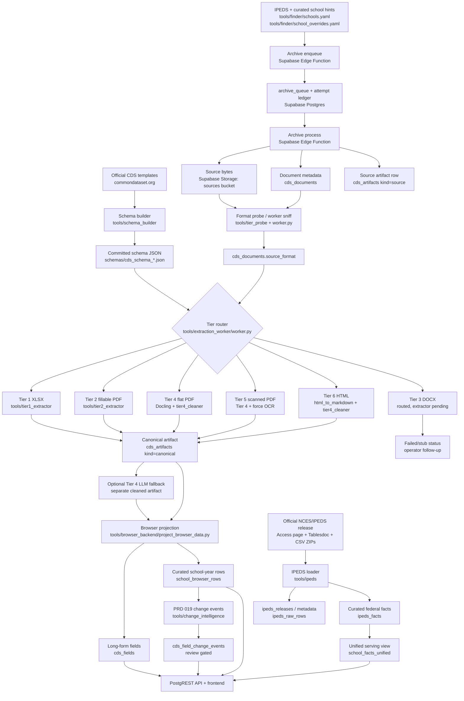

# Data Extraction Pipeline Map

This is the operational map for how collegedata.fyi turns decentralized Common
Data Set files into public, queryable rows, plus the adjacent federal baseline
path that now supplies NCES/IPEDS facts for schools without a public CDS. It
focuses on where each step lives, how often it runs, what it writes, and the
constraints that matter during data quality work.

For deeper design context, see [ARCHITECTURE.md](ARCHITECTURE.md),
[archive-pipeline.md](archive-pipeline.md), and
[extraction-quality.md](extraction-quality.md).

## End-to-End Flow



## Operating Table

| Step | Primary code | Housed data | Cadence | Constraints and known issues |
|---|---|---|---|---|
| Schema extraction | `tools/schema_builder/build_from_xlsx.py`, `tools/schema_builder/build_2023_24_canonical.py`, `tools/schema_builder/decode_checkboxes.py` | `schemas/cds_schema_YYYY_YY.json`, `schemas/templates/` | Once per CDS template year, operator-run | Extractors depend on schema-year coverage. 2023-24, 2024-25, and 2025-26 have canonical schemas; 2019-20 through 2022-23 remain structural/overlay years and fall back for deterministic extraction. |
| Corpus and hints | `tools/finder/build_school_list.py`, `tools/finder/probe_urls.py`, `tools/finder/school_overrides.yaml` | `tools/finder/schools.yaml` and override hints | Monthly/ad-hoc operator work | Search misses Box/Drive-hosted files, thinly indexed subdomains, JS-only interfaces, and landing pages with no searchable CDS text. Manual hints should cover current year, prior year, and future finder behavior. |
| Archive enqueue | `supabase/functions/archive-enqueue` | `archive_queue` | Daily at `02:00 UTC`; monthly `run_id` makes repeat daily calls mostly no-op | Requires Vault secrets for function base URL and service-role key. Enqueues active schools with hints, minus cooldowned outcomes. |
| Archive process | `supabase/functions/archive-process`, shared resolver code in `supabase/functions/_shared/` | `cds_documents`, source `cds_artifacts`, Supabase Storage `sources` bucket, `school_hosting_observations`, `archive_queue_attempts` | Every `30 seconds` by pg_cron; one school per invocation | Edge runtime limits are why work is one school at a time. Each claim gets an attempt-ledger row; queue completion and attempt duration/outcome commit atomically, while reclaimed expired leases are recorded as `timed_out`. Also handles SHA-addressed source storage, SSRF guard, 50 MB file cap, 30 s fetch timeout, cooldown outcomes, sectionized CDS packages, and HTML auth-wall/bot-challenge rejection. Some schools still need operator manual uploads. |
| Manual upload / force archive | `tools/upload/`, `archive-process?force_urls`, `archive-upload` | Same as archive process, usually `source_provenance='operator_manual'` or explicit mirror provenance | Ad-hoc | Use when the public resolver is blocked by WAF, Tableau/PowerBI export, Box/Drive, SharePoint viewers, or no crawlable landing page. New source bytes flip the document back to `extraction_pending`. |
| Format classification | `tools/tier_probe/probe.py`; fallback sniffing in `tools/extraction_worker/worker.py` | `cds_documents.source_format` | Once per archive drain; worker also corrects stale/missing labels | Classification is byte-derived. DOCX and XLSX both start as ZIP files, so internals must be inspected. `source_format='other'` exits fast for operator review. |
| Extraction worker | `tools/extraction_worker/worker.py` | `cds_artifacts kind=canonical`, `cds_documents.extraction_status`, `cds_documents.detected_year` | Tiny daily GitHub Actions drain at `09:17 UTC`; managed large drains run on an operator laptop or self-hosted runner | Scheduled GitHub-hosted ops runs default to 5 rows / 25 minutes to preserve Supabase IO budget. Manual dispatch is capped at 100 rows. Full Docling/OCR drains belong locally or on a self-hosted runner. Worker idempotency checks producer, producer version, schema version, and source SHA; version bumps are still required before redraining cleaner changes unless the operator uses `--force-reextract`. `--reconcile-pending` repairs rows already covered by current artifacts, and `--deadline-minutes` exits cleanly before CI hard timeouts. The worker writes its summary first, then exits non-zero when any real document failure occurred so scheduled drains cannot appear green while containing failed rows. |
| Tier 1 XLSX | `tools/tier1_extractor/extract.py` | Canonical artifact with `producer='tier1_xlsx'` | Triggered by extraction worker | Deterministic for standard templates and embedded question/answer columns. 2024-25 and 2025-26 have template cell maps; 2023-24 has a canonical schema but its XLSX template is visual-only and currently yields no deterministic Tier 1 map. Custom workbooks or old template layouts may produce sparse rows. |
| Tier 2 fillable PDF | `tools/tier2_extractor/extract.py` | Canonical artifact with `producer='tier2_acroform'` | Triggered by extraction worker | Near deterministic when populated AcroForm fields exist. Header identity fields may be blank even when visible in the PDF, so school identity should come from `cds_documents`/corpus metadata. |
| Tier 3 DOCX | Routed in `worker.py`; extractor scoped by PRD 007 | No successful canonical DOCX tier yet | Not built | DOCX routing is fixed so files no longer masquerade as XLSX, but extraction is still a stub. Rows fail fast and need future SDT extraction. |
| Tier 4 flat PDF | `tools/extraction_worker/tier4_extractor.py`, `tier4_cleaner.py`, `tier4_native_tables.py` | Canonical artifact with `producer='tier4_docling'`; raw markdown/native table notes in `cds_artifacts.notes` | Triggered by worker; redrains are operator-managed | Highest volume and highest variance path. Docling table serialization can lose layout, merge columns, or omit visually present values. Recent repairs include visual OCR/layout text for C1/C9, visual-only B1 recovery, and cleaner fixes for C1/C9 layouts, but narrative-grade changes still need canary/source review. |
| Tier 5 scanned PDF | Same Tier 4 path with `force_ocr=True` | Canonical artifact with `producer='tier4_docling'` and scanned source format | Triggered by worker for `pdf_scanned` | Force OCR is required; Docling auto-OCR is not reliable enough. OCR is slower and can still miss small tables or low-quality scans. |
| Tier 6 HTML | `tools/extraction_worker/html_to_markdown.py` plus Tier 4 cleaner | Canonical artifact with `producer='tier6_html'` | Triggered by worker | Works when the archived HTML contains real table content. JS-rendered dashboards usually require manual export to PDF/XLSX first. |
| LLM fallback | `tools/extraction_worker/llm_fallback_worker.py`, `tier4_llm_fallback.py` | Separate `cds_artifacts` cleaned row, usually `producer='tier4_llm_fallback'` | Operator-run, not routine CI | Fallback is a gap-fill overlay only. Deterministic base cleaner wins conflicts; fallback must match the selected Tier 4 base artifact before projection can merge it. |
| Browser projection | `tools/browser_backend/project_browser_data.py` and replacement RPCs | `cds_fields`, `school_browser_rows`, metadata tables/views | Incremental after successful worker writes; full rebuild operator-run after migrations/projection changes | Serving rows are materialized. Rates are stored as fractions. Projection filters/normalizes invalid SAT/ACT/rate values rather than exposing obvious canaries. Full rebuild is required after schema/alias/projection logic changes. |
| Data quality audits | `tools/data_quality/*`, `tools/browser_backend/prd*_audit.py`, `tools/change_intelligence/audit_watchlist_freshness.py` | Reports under `.context/reports/`; optional flags in `cds_documents.data_quality_flag` | Ad-hoc and before narrative/reporting work | Audits do not own data. They find canaries, low-field artifacts, visual OCR candidates, stale producer versions, and source-mapping gaps. Prefer narrow candidate queries first; broad artifact-note scans require an explicit large-scan flag and should run only during low-traffic windows. For canaries, search for similar files and redrain the class, not only the one school. |
| PRD 019 change intelligence | `tools/change_intelligence/project_change_events.py`, `review_change_event.py`, watchlists under `data/watchlists/` | `cds_field_change_events`, `cds_field_change_event_reviews`, `.context/reports/` | Operator-run; no cron | Compares selected `school_browser_rows`, not raw artifacts. Major changes and `newly_missing` events require human source review before publication. Events default to `public_visible=false`. |
| IPEDS federal baseline | `tools/ipeds/download_release.py`, `tools/ipeds/load_release.py`, `.github/workflows/ipeds-release-probe.yml` | `ipeds_releases`, `ipeds_tables`, `ipeds_columns`, `ipeds_value_labels`, `ipeds_raw_rows`, `ipeds_facts`, `ipeds_current_facts_cache`, `school_facts_unified` | Monthly release probe; operator-run load when NCES publishes | Uses official NCES/IPEDS sources only. Public products read curated facts/serving views, not raw JSONB rows. Historical analysis should filter `ipeds_facts` by `ipeds_id`, `field_key`, and `data_year`; current school-page/API reads use the materialized latest-fact cache. Probe no-ops until 10 months after latest loaded provisional release date, then opens operator issues for final/provisional updates. |
| Coverage refresh | `supabase/functions/refresh-coverage`, `refresh_institution_cds_coverage()` SQL | `institution_cds_coverage`, coverage statuses | Hourly by pg_cron | Public coverage can lag archive/extraction by up to one refresh interval. Operator overrides and hosting observations affect status classification. The edge function skips the extra status-histogram read unless called with `{"include_histogram": true}`. |
| Public API/frontend | PostgREST at `api.collegedata.fyi`, `browser-search`, Next.js web app | Public views/tables: `cds_documents`, `cds_artifacts`, `cds_fields`, `school_browser_rows`, `school_merit_profile`, `school_facts_unified`, reviewed `cds_field_change_events` | On demand | Frontend surfaces curated browser rows, archive downloads, IPEDS federal baseline facts, and reviewed change events. Unreviewed PRD 019 events remain operator-only. |

## Tier Routing Summary

| `source_format` | Tier | Producer | Quality expectation | Main failure modes |
|---|---:|---|---|---|
| `xlsx` | 1 | `tier1_xlsx` | Very high for standard CDS workbooks | Custom layouts, older templates without a matching schema/template map, sparse section-only workbooks |
| `pdf_fillable` | 2 | `tier2_acroform` | Very high when form fields are populated | Flattened PDFs route away; visible header fields can be absent from AcroForm data |
| `docx` | 3 | pending | Expected high once SDT extractor ships | Extractor not built; rows are intentionally failed/stubbed |
| `pdf_flat` | 4 | `tier4_docling` | Good for launch-certified fields, variable across long tail | Table flattening, merged columns, missing visually present values, section fragments, wrong source files |
| `pdf_scanned` | 5 | `tier4_docling` with OCR | Variable | OCR misses, noisy scans, slow drains, C1/C9 visual text gaps |
| `html` | 6 | `tier6_html` | Good for structured HTML tables | JS-only dashboards, Tableau/PowerBI shells, incomplete HTML snapshots |
| `other` | none | none | Not extractable | Wrong file, challenge HTML, unsupported content, bad archive bytes |

## Freshness and Redrain Rules

- **Source freshness starts at discovery.** The archive pipeline preserves bytes
  as soon as a CDS-ish file is found. If the source bytes change, the document is
  marked `extraction_pending` again.
- **Content year wins.** URL year guesses are resolver hints only. The worker
  writes `cds_documents.detected_year` from document content, and browser rows
  use the resolved canonical year.
- **Producer version is the redrain key.** Cleaner or extractor behavior changes
  must bump `producer_version`; otherwise the worker can correctly skip a row as
  already extracted.
- **Projection is separate from extraction.** A new canonical artifact is not
  useful to the website until `cds_fields` and `school_browser_rows` are refreshed.
  Worker drains do this incrementally unless `--skip-projection-refresh` is set.
- **Canary fixes should be corpus fixes.** When a visible extraction bug is found,
  audit for similar artifacts, redrain the whole candidate set, and re-run the
  serving projection.
- **Finder/source fixes should cover time.** When a source discovery issue is
  found, find the most recent two years if available, archive/backfill both, and
  add a durable hint or override so the next year is findable.

## Known Operational Blind Spots

| Blind spot | Current mitigation |
|---|---|
| Schools publish on Box, Drive, SharePoint, Tableau, PowerBI, or WAF-protected hosts | Add `school_overrides.yaml` hints, use WAF-aware/manual downloads, or upload operator-exported PDFs/XLSX files. |
| Public landing page lists sections instead of full CDS | Prefer full `*_All.pdf`/`*_Full.pdf` when available. When two or more same-year A-J section files are available and no full-CDS file exists, the archive layer stores each original as `source_part` and builds one derived logical source PDF for extraction. Single-section pages still require source-scope review. |
| Wrong-campus or wrong-source files | Add source-mapping overrides and reject notes, e.g. OSU Columbus vs Wooster/ATI, UW Seattle vs Tacoma/Bothell, Penn CDS vs commondataset.org template docs. |
| Current year is not public yet | Record the official landing page and notes. Treat as `targetable_gap` rather than extraction failure. Recheck during publication season. |
| Tier 4 stale artifacts after cleaner improvements | Use freshness audits to identify stale `tier4_docling` versions and targeted redrain document IDs. |
| Major PRD 019 changes can be real but surprising | Require PDF/source review before narrative reporting, especially for large C1 applicant/admit/enrollment deltas and `newly_missing` fields. |
| Public data cannot answer unique-student demand by itself | CDS C1 applicant counts are per-school application counts, not deduplicated people. Aggregate application totals answer application volume, not birth-cohort demand directly. |

## Common Operator Commands

```bash
# Freshness audit for the Top 200 watchlist.
/Users/santhonys/docling-eval/bin/python \
  tools/change_intelligence/audit_watchlist_freshness.py \
  --env /path/to/.env \
  --watchlist data/watchlists/top_200_change_intelligence.yaml \
  --from-year 2024 \
  --to-year 2025 \
  --out-dir .context/reports/prd019-top200-current-analysis

# Project PRD 019 candidate events without publishing them.
/Users/santhonys/docling-eval/bin/python \
  tools/change_intelligence/project_change_events.py \
  --env /path/to/.env \
  --from-year 2024 \
  --to-year 2025 \
  --watchlist data/watchlists/top_200_change_intelligence.yaml \
  --csv .context/reports/change-events.csv \
  --report .context/reports/change-events.md \
  --summary-json .context/reports/change-events-summary.json

# Targeted extraction redrain after a cleaner/version bump.
/Users/santhonys/docling-eval/bin/python \
  tools/extraction_worker/worker.py \
  --env /path/to/.env \
  --requeue-document-ids <uuid>,<uuid> \
  --document-ids <uuid>,<uuid> \
  --min-year-start 2024 \
  --seed-projection-metadata \
  --summary-json .context/reports/redrain-summary.json

# Full browser projection rebuild after a projection/schema change.
python tools/browser_backend/project_browser_data.py --full-rebuild --apply

# IPEDS release probe dry run for the January 2027 due date.
python tools/ipeds/probe_releases.py --as-of 2027-01-01

# IPEDS dry-run load. Review the generated report before adding --apply.
python tools/ipeds/load_release.py \
  --metadata-xlsx scratch/ipeds/2024-25-provisional/IPEDS202425Tablesdoc.xlsx \
  --data-dir scratch/ipeds/2024-25-provisional \
  --collection-year 2024-25 \
  --data-year 2024 \
  --release-type provisional \
  --release-date 2026-03-01 \
  --release-date-text "March 2026" \
  --metadata-url https://nces.ed.gov/ipeds/tablefiles/tableDocs/IPEDS202425Tablesdoc.xlsx

# One-command automation health check: GitHub Actions, pg_cron,
# async Edge Function HTTP responses, archive queue, extraction movement,
# and coverage freshness.
python3 tools/ops/automation_health.py \
  --env /path/to/.env \
  --markdown-out scratch/automation-health.md \
  --json-out scratch/automation-health.json
```
